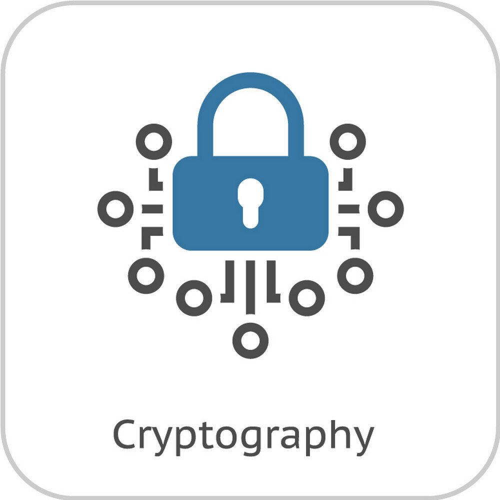

# Bornomala-Symmetric-Key (BSK) Stream Cipher

   
<a href="#key_generation">Key_Generation</a> • <a href="#encryption">Encryption</a> • <a href="#decryption">Decryption</a> • <a href="#advantages">Advantages</a> •

---
Key_Generation
---

- A strong key is required, a minimum of 8 character
- Key must have to contain uppercase, lowercase, and digits. 
- No Space is allowed in a key

> Gerated-Key is similar with hashing  
> Unless fixed length hashing, the generated key is of any size depanding on inputs [variable-length hashing]

Encryption
--------
